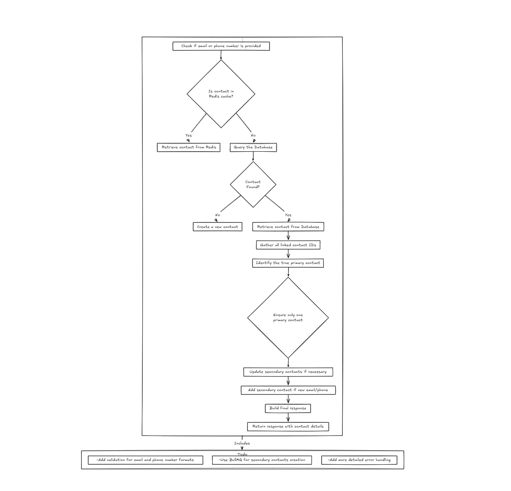

# Bitespeed Backend Task: Identity Reconciliation

## Deployment

This project is hosted on **Google Cloud Platform (GCP)** and runs in a production environment with the following setup:

- Managed using **PM2** in cluster mode (`pm2 -i max`) to utilize all available CPU cores.
- Hosted behind **Nginx** as a reverse proxy.
- Secured with **SSL** via **Certbot** and Let's Encrypt.
- Vertically scaled to handle production-level traffic.
- API documentation is available at:
  👉 [http://task.ravi-ranjan.xyz/api-docs](http://task.ravi-ranjan.xyz/api-docs)
